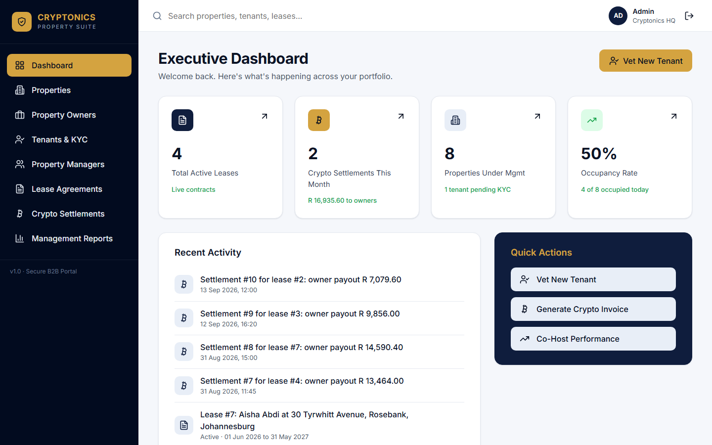
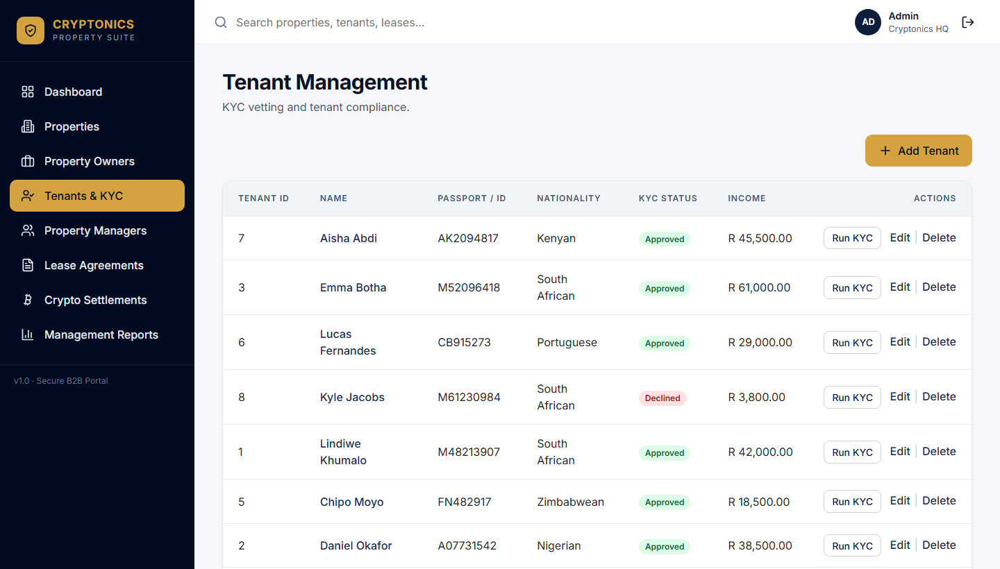
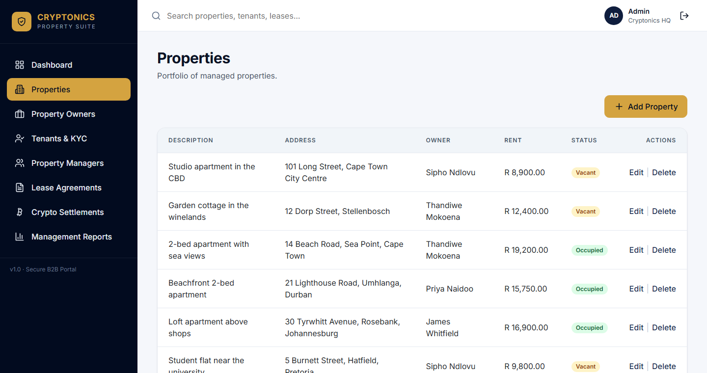
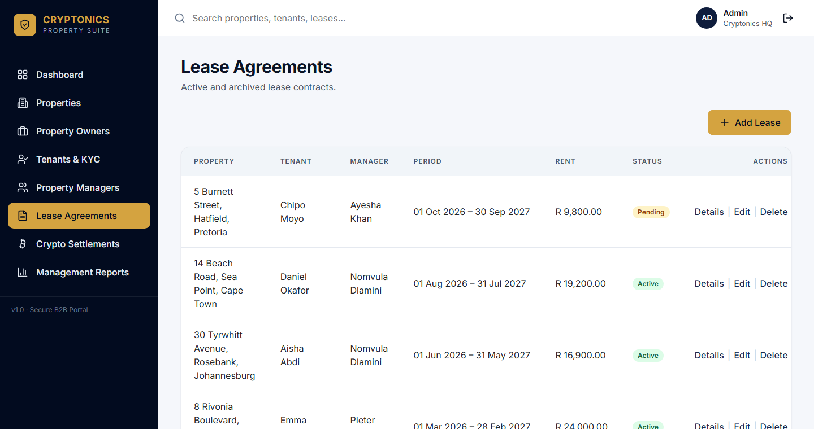
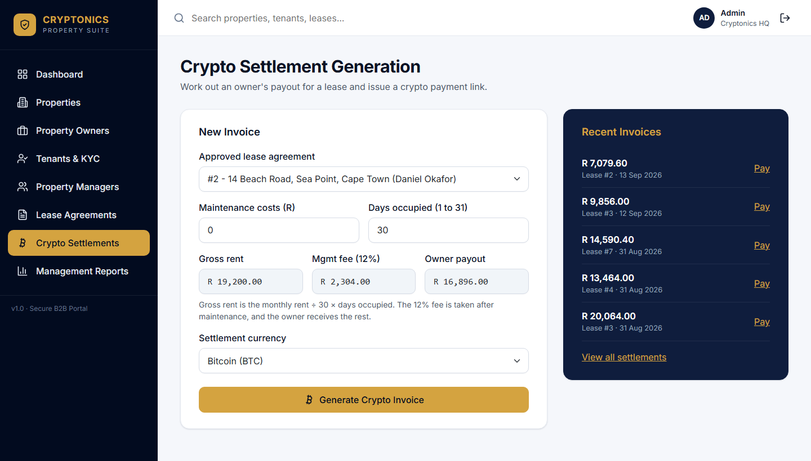
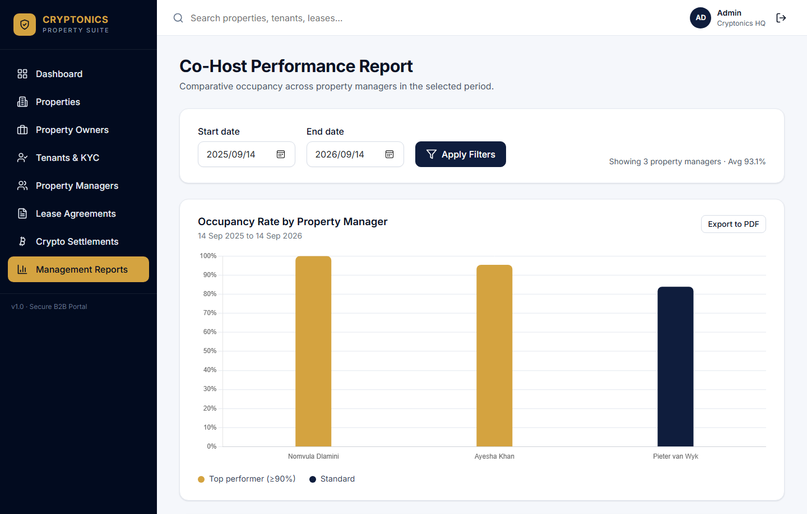
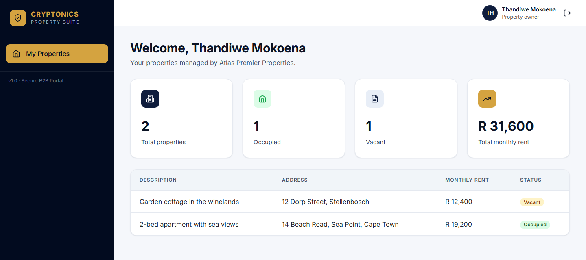
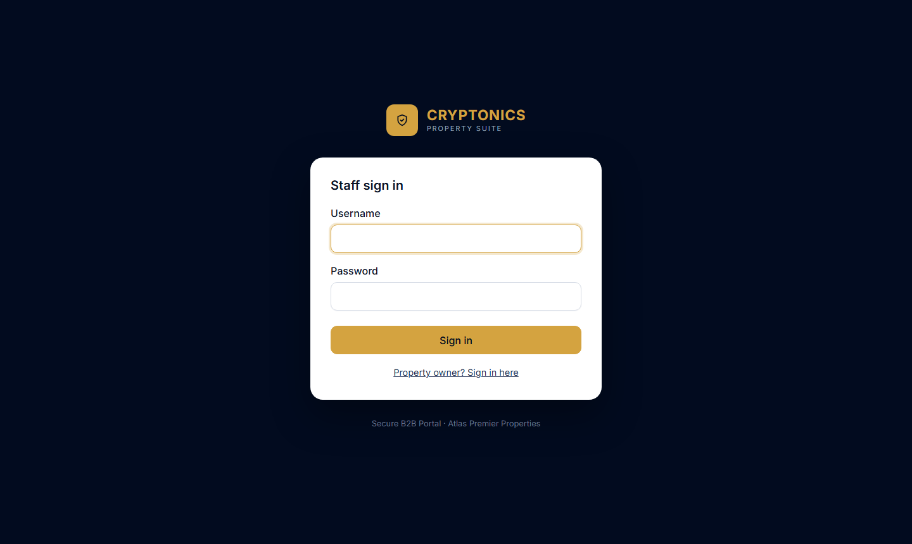
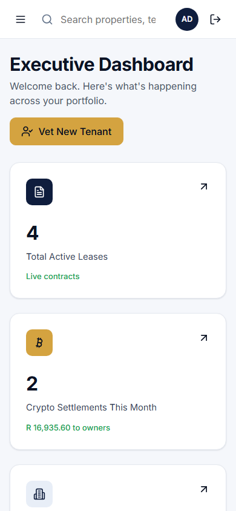

# Cryptonics Property Management System

A property management web app for Atlas Premier Properties. Staff manage owners, properties, tenants, leases and monthly settlements. Property owners sign in to a portal to see their own properties.

Live site: https://d521aqku9szcv.cloudfront.net (when the server is running)

## Features

| Area | What it does |
| --- | --- |
| Staff sign-in | Username and password accounts for staff. The first administrator is created on the Setup page. |
| Dashboard | Active leases, this month's crypto settlements, properties under management, today's occupancy rate, recent activity and quick actions. |
| Search | The search box at the top of every staff page finds properties, tenants, leases and owners. |
| Owners | Add, edit and delete owners. Give an owner a portal password so they can sign in. |
| Owner portal | Owners see their properties, which are vacant or occupied, and their total monthly rent. |
| Properties | Add, edit and delete properties, each linked to an owner. Addresses must be unique. |
| Tenants | Add, edit and delete tenants, and run a KYC check on each one. |
| Leases | Link a property, a KYC-approved tenant and a property manager, with dates, rent and a status. |
| Property managers | Add, edit and delete the managers (co-hosts) who look after leases. |
| Settlements | Work out the owner's payout for a lease and generate a crypto payment invoice link. |
| Reports | Co-host performance: each manager's occupancy rate over a date range. |

## Screenshots

The screenshots show fictional demo data.

**Executive dashboard**



<table>
  <tr>
    <td width="50%"><strong>Tenants and KYC</strong><br></td>
    <td width="50%"><strong>Properties</strong><br></td>
  </tr>
  <tr>
    <td><strong>Lease agreements</strong><br></td>
    <td><strong>Crypto settlement invoice</strong><br></td>
  </tr>
  <tr>
    <td><strong>Co-host performance report</strong><br></td>
    <td><strong>Owner portal</strong><br></td>
  </tr>
  <tr>
    <td><strong>Staff sign-in</strong><br></td>
    <td><strong>Dashboard on a phone</strong><br></td>
  </tr>
</table>

## Business rules

- **KYC**: a tenant is approved when they have a passport or ID number, a nationality and a declared monthly income of at least R5,000. Otherwise they are declined. This is a simulated check (`Services/KycService.cs`).
- **Leases**
  - Only tenants whose KYC status is Approved can be put on a lease.
  - The end date must be after the start date.
  - A property can't have two Pending or Active leases with overlapping dates. Ended and Terminated leases don't count.
  - A lease with settlements can't be deleted. Set its status to Ended or Terminated instead.
- **Deletes**: owners with properties, and properties or tenants with leases, can't be deleted.
- **Settlements** (`Services/SettlementService.cs`):
  1. Gross rent = monthly rent ÷ 30 × days occupied (1 to 31). 30 days gives the full rent.
  2. Net amount = gross rent − maintenance costs.
  3. Management fee = 12% of the net amount.
  4. Owner payout = net amount − management fee.
  5. A payment link is generated for the payout in the chosen currency: Bitcoin, Ethereum, Tether or USD Coin. This is simulated (`Services/CryptoInvoiceService.cs`) and doesn't take real payments.
- **Co-host report**: for each manager, the days their leases overlap the chosen period, divided by the days in the period. It defaults to the last 12 months, and managers at 90% or above are marked as top performers.

## Tech stack

- ASP.NET MVC 5 on .NET Framework 4.8 (C#, Razor views, Bootstrap 5)
- Microsoft Access database (`.accdb`) accessed with OleDb, using repositories in `Repositories/`
- Forms authentication with two roles: Staff and Owner. Passwords are hashed with PBKDF2 (`Helpers/PasswordHasher.cs`).
- Hosting: AWS, using Windows Server 2022 and IIS on EC2 behind CloudFront (see [Deploying to AWS](#deploying-to-aws))

## Project layout

```
Controllers/        One controller per area (Leases, Tenants, Owners, OwnerPortal, Account, ...)
Models/Entities/    Classes that mirror the database tables
Models/ViewModels/  Classes for sign-in, setup and the owner portal
Repositories/       All SQL lives here
Services/           KYC, settlement, crypto invoice and report logic
Helpers/            Database connection, password hashing, sign-in cookie
Filters/            Owner portal authorization
Views/              Razor pages
deploy/aws/         CloudFormation template and PowerShell deployment scripts
```

This is a classic `.csproj`. **Every new `.cs` file and view must be listed in `AtlasPremierProperties.csproj`.** Otherwise it isn't compiled or published, even though Visual Studio may show it. Adding files through Visual Studio's Solution Explorer does this for you.

## Running locally

### 1. Install

- Visual Studio 2022 with the **ASP.NET and web development** workload
- [Microsoft Access Database Engine 2016 Redistributable](https://www.microsoft.com/en-us/download/details.aspx?id=54920), 64-bit (`accessdatabaseengine_X64.exe`)
- In Visual Studio, go to **Tools → Options → Projects and Solutions → Web Projects** and tick **Use the 64 bit version of IIS Express**. The Access engine and IIS Express must both be 64-bit, or you get "The 'Microsoft.ACE.OLEDB.12.0' provider is not registered".

### 2. Get the database

The database is **not** in this repository, because it holds personal data and password hashes. Get `Cryptonics_DB.accdb` from the team and point the app at it in `Web.config`:

```xml
<add key="DatabasePath" value="C:\CryptoniCS\Cryptonics_DB.accdb"/>
```

The app expects these tables: `Owners`, `Properties`, `Tenants`, `PropertyManagers`, `LeaseAgreements`, `Settlements` and `SystemUsers`. If your copy of the database is older, add the columns this version needs. Run each of these in Access (**Create → Query Design → SQL View**), skipping any column that already exists:

```sql
ALTER TABLE Owners ADD COLUMN PasswordHash TEXT(255);
ALTER TABLE PropertyManagers ADD COLUMN PhoneNumber TEXT(20);
ALTER TABLE PropertyManagers ADD COLUMN DateHired DATETIME;
```

Close Access before running the app. An open database can lock the file.

### 3. Run and create the first administrator

1. Open `AtlasPremierProperties.sln` and press **F5**. NuGet packages restore automatically.
2. While the database has no staff users, go to `/Account/Setup` and create an administrator (password of at least 10 characters).
   - The Setup page only works from the same machine as the app.
   - It disappears once a user exists.
3. Sign in at **Staff sign in**.

### 4. Give an owner portal access

As staff, open **Owners**, then create or edit an owner and set a **Portal password**. The owner signs in at **Owner sign in** with their email address and that password. Leaving the field blank when editing keeps the current password.

### Suggested demo order

Owners → Properties → Property managers → Tenants (then Run KYC) → Leases → Settlements → Reports → Owner portal.

## Deploying to AWS

### Architecture

```
Browser ──HTTPS──> CloudFront ──HTTP──> EC2 (Windows Server 2022, IIS) ── C:\AtlasData\Cryptonics_DB.accdb
                                          ▲
                   S3 bucket (site package, installers, database copy, logs)
```

- Everything is defined in `deploy/aws/atlas-stack.yaml` and runs in **Cape Town (`af-south-1`)**.
- The server only accepts web traffic from CloudFront.
- It has no open RDP port and no key pair. Administration goes through AWS Systems Manager.

### Deploy or update

Prerequisites:

- The **AWS CLI v2** and the **Session Manager plugin**.
- `aws configure` run with your own access key and default region `af-south-1`. Cape Town is an opt-in region, so enable it in your account first.
- Visual Studio 2022 (the script uses its MSBuild).
- `accessdatabaseengine_X64.exe` in your `Downloads` folder.
- The database at `Desktop\Cryptonics\Cryptonics_DB.accdb`. It's only uploaded on the first deploy.

Then, from the repository folder in PowerShell:

```powershell
.\deploy\aws\deploy.ps1
```

The script:

1. Creates or updates the stack. The first run takes 10 to 20 minutes, mostly waiting for CloudFront.
2. Publishes the app and uploads it to S3.
3. Installs IIS, ASP.NET and the Access engine on the server.
4. Checks that the sign-in page loads.

Run the same command again to deploy new code. **The live database is kept.**

`-ReplaceDatabase` overwrites the live database with your local copy. It keeps a `.bak` of the old one on the server, but any data entered on the live site since then is no longer in use. Only use it on purpose.

### Create the first administrator on the server

The Setup page only works from the server itself, so reach it through a Systems Manager tunnel. Run this and leave it open:

```powershell
aws ssm start-session --target <InstanceId> --region af-south-1 --document-name AWS-StartPortForwardingSession --parameters 'portNumber=80,localPortNumber=8080'
```

Then open http://localhost:8080/Account/Setup. `<InstanceId>` is printed at the end of `deploy.ps1` and is also shown in the stack's **Outputs** tab in CloudFormation.

Forgotten the password? Passwords are hashed and can't be recovered. Delete the user from the `SystemUsers` table in the server's database, then run Setup again.

### Costs and stopping the server

- A t3.small server costs about **US$40 a month** while running.
- It costs about **US$7 a month** while stopped, for the disk and the Elastic IP.

Stop it when you aren't demoing:

```powershell
aws ec2 stop-instances --instance-ids <InstanceId> --region af-south-1
aws ec2 start-instances --instance-ids <InstanceId> --region af-south-1
```

The site address stays the same after a restart. Give the server a few minutes to boot.

### Back up the live database

The server can only write to the bucket's `ssm-logs/` folder, so copy the database there and download it. `<ArtifactBucketName>` is in the stack's **Outputs** tab.

```powershell
$instanceId = '<InstanceId>'
$bucket = '<ArtifactBucketName>'
$commands = @(
    'Copy-Item C:\AtlasData\Cryptonics_DB.accdb C:\AtlasData\backup.accdb -Force',
    "Write-S3Object -BucketName $bucket -Key ssm-logs/backups/Cryptonics_DB.accdb -File C:\AtlasData\backup.accdb -Region af-south-1"
)
[IO.File]::WriteAllText("$env:TEMP\atlas-backup.json", (@{ commands = $commands } | ConvertTo-Json))
aws ssm send-command --instance-ids $instanceId --region af-south-1 --document-name AWS-RunPowerShellScript --parameters "file://$env:TEMP\atlas-backup.json"

# Wait about 30 seconds, then download it:
aws s3 cp "s3://$bucket/ssm-logs/backups/Cryptonics_DB.accdb" .\Cryptonics_DB-live.accdb --region af-south-1
```

### Delete everything

```powershell
.\deploy\aws\teardown.ps1
```

This permanently deletes the server, **including its database**, plus the S3 bucket and the CloudFront distribution. Back up the database first.

## Known limitations

- **Access database:** it suits a single server and light use. It doesn't handle many simultaneous users well, and there are no automatic backups. Moving to SQL Server or Amazon RDS would be the next step for real use.
- **Simulated services:** KYC and the crypto invoice link are simulated, not connected to real providers.
- **Leases and vacancy:** creating a lease doesn't change the property's Vacant flag automatically.
- **Settlement status:** settlements don't record whether the crypto invoice has been paid.
